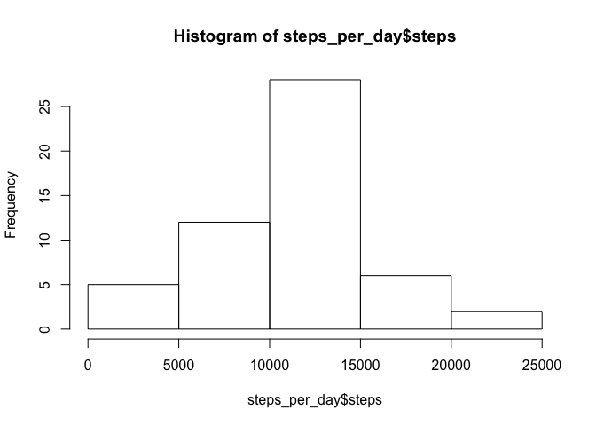
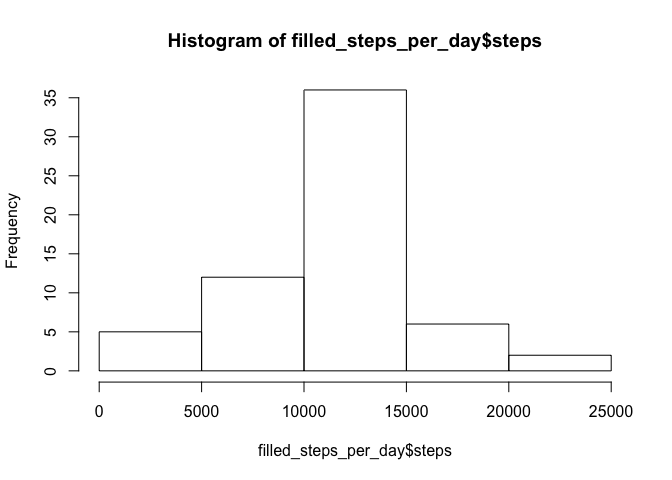
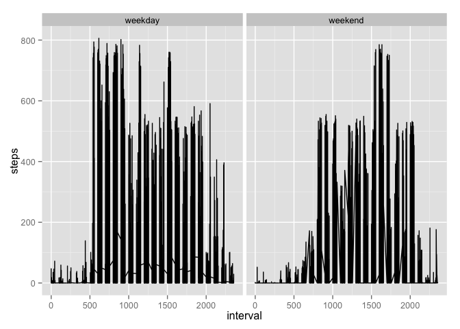

# Activity Analysis
Emmet Murphy  
June 6, 2016  

### Load the data

1. Read in the CSV.


```r
activities <- read.csv(unz('activity.zip', 'activity.csv'))
```

### What is mean total number of steps taken per day?

1. Calculate total number of steps per day.


```r
steps_per_day <- aggregate(activities$steps, by=list(activities$date), sum)
```

2. Plot a histogram of the total number of steps per day.


```r
names(steps_per_day) = c("date", "steps") 
hist(steps_per_day$steps)
```

\

3. Summarize the total number of steps per day, including mean and median.


```r
summary(steps_per_day)
```

```
##          date        steps      
##  2012-10-01: 1   Min.   :   41  
##  2012-10-02: 1   1st Qu.: 8841  
##  2012-10-03: 1   Median :10765  
##  2012-10-04: 1   Mean   :10766  
##  2012-10-05: 1   3rd Qu.:13294  
##  2012-10-06: 1   Max.   :21194  
##  (Other)   :55   NA's   :8
```

### What is the average daily activity pattern?

1. Time series plot the average number of steps taken per 5-minute interval, averaged across all days.


```r
avg_steps_per_interval <- aggregate(activities$steps, by=list(activities$interval), mean, na.rm=TRUE)
names(avg_steps_per_interval) = c("interval", "steps") 
plot(avg_steps_per_interval, type="l")
```

\

2. Which 5-minute interval, on average across all the days in the dataset, contains the maximum number of steps?


```r
avg_steps_per_interval[which.max(avg_steps_per_interval$steps),]
```

```
##     interval    steps
## 104      835 206.1698
```

### Imputing missing values

1. Calculate and report the total number of missing values in the dataset (i.e. the total number of rows with 𝙽𝙰s)


```r
sum(is.na(activities$steps))
```

```
## [1] 2304
```

2. Fill in missing values using mean per interval


```r
library(plyr)
impute.mean <- function(x) replace(x, is.na(x), mean(x, na.rm = TRUE))
filled_activities <- ddply(activities, ~ interval, transform, steps = impute.mean(steps))
```

3. Create a new dataset that is equal to the original dataset but with the missing data filled in.


```r
filled_activities <- filled_activities[order(filled_activities$date, filled_activities$interval), ] #plyr orders by group so we have to reorder
```

4. Make a histogram of the total number of steps taken each day and Calculate and report the mean and median total number of steps taken per day. Do these values differ from the estimates from the first part of the assignment? What is the impact of imputing missing data on the estimates of the total daily number of steps?


```r
filled_steps_per_day <- aggregate(filled_activities$steps, by=list(filled_activities$date), sum)
names(filled_steps_per_day) = c("date", "steps") 
hist(filled_steps_per_day$steps)
```

\

### Are there differences in activity patterns between weekdays and weekends?

1. Create a new factor variable in the dataset with two levels – “weekday” and “weekend” indicating whether a given date is a weekday or weekend day.


```r
filled_activities$date_type <- ifelse( as.POSIXlt(filled_activities$date)$wday %in% c(0,6), 'weekend', 'weekday')
```

2. Make a panel plot containing a time series plot (i.e. 𝚝𝚢𝚙𝚎 = "𝚕") of the 5-minute interval (x-axis) and the average number of steps taken, averaged across all weekday days or weekend days (y-axis). See the README file in the GitHub repository to see an example of what this plot should look like using simulated data.


```r
library(ggplot2)
g <- ggplot(filled_activities, aes(interval, steps))
g + facet_grid(. ~ date_type) + geom_line() 
```

\
